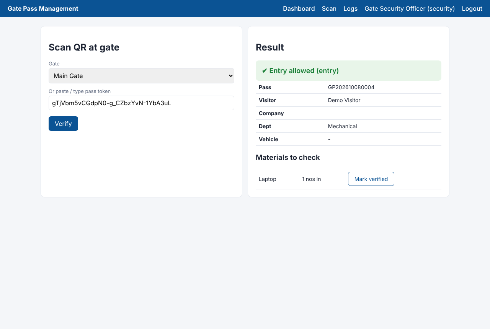

# QR Code Gate Pass Management System

A Flask web app that replaces paper gate passes with QR codes: staff issue passes, security officers scan them at the gate, and every entry, exit and material movement is logged.

> **Demo recreation.** This is an original, from-scratch reimplementation of the kind of system I built during my Software Engineering internship at Steel Authority of India Limited (SAIL), Ranchi. It contains no SAIL code or data; all sample records are fictional.



## Features

- **Gate pass generation** with auto-numbered passes (`GP20261008xxxx`), configurable validity window and printable pass with QR code.
- **QR verification at entry points**: camera scanning in the browser (html5-qrcode) or manual token entry. First scan records entry, second scan records exit, any later scan is rejected. Expired and revoked passes are refused.
- **Material entry tracking**: inward/outward items with quantity, unit and returnable flag; guards tick each item as verified at the gate.
- **Role-based access**: `admin` (users, revoke, CSV export), `security` (scan, logs), `staff` (issue and view their own passes).
- **Audit log** of every scan with officer, gate and timestamp.
- QR codes carry an unguessable random token, never personal data.

## Tech stack

Python, Flask, Flask-SQLAlchemy, SQLite (swap to PostgreSQL via `DATABASE_URL`), qrcode, Jinja2, vanilla JS.

## Run locally

```bash
python -m venv .venv && source .venv/bin/activate
pip install -r requirements.txt
python wsgi.py            # http://localhost:5000
```

Demo logins: `admin / admin123`, `guard / guard123`, `staff / staff123`.

Try it: log in as **staff**, issue a pass, open it and copy the token under the QR. Log in as **guard**, open **Scan** and paste the token (or scan the QR from your phone screen with a webcam). Scan again to record exit.

## Tests

```bash
pytest -q
```

## Deploy

- **Render**: push to GitHub, then *New > Blueprint* and pick this repo (`render.yaml` is included).
- **Docker**: `docker build -t gatepass . && docker run -p 8000:8000 gatepass`

| Variable | Default | Purpose |
|---|---|---|
| `SECRET_KEY` | dev value | Flask session signing key (set in production) |
| `DATABASE_URL` | `sqlite:///instance/gatepass.db` | Any SQLAlchemy URL |
| `PASS_VALIDITY_HOURS` | `12` | Default pass validity |
| `SEED_DEMO_DATA` | `1` | Create demo users and sample passes on first run |

Note: SQLite on Render's free tier resets on redeploy. Use a Postgres `DATABASE_URL` for persistent data.

## Project structure

```
app/
  __init__.py   app factory, security headers
  models.py     User, GatePass, MaterialEntry, ScanLog + demo seed
  auth.py       session login and role decorator
  passes.py     issue, view, QR, scan/verify API
  admin.py      users, revoke, logs, CSV export
  templates/    Jinja2 pages
tests/          pytest suite
```
